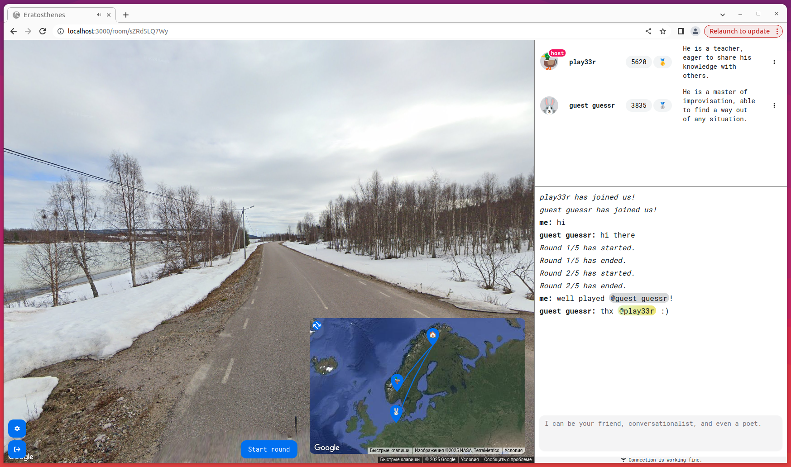

### Local deployment

1. Set up [the backend](https://github.com/v-spassky/eratosthenes-server).

2. Create a `.env` file and configure it as in the `.env.example` file.

3. Run the frontend:

> [!NOTE]
> Because of the issues with Google Maps loader the screen with the map doesn't always work correctly in strict mode,
> so it's better to run the server in development mode.

```bash
npm install -g serve
```

```bash
npm run build && serve -s build
```

### QA

```bash
npx prettier --check src/
```

```bash
npx eslint src/
```

```bash
npx tsc --noEmit
```
